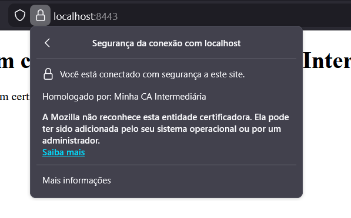
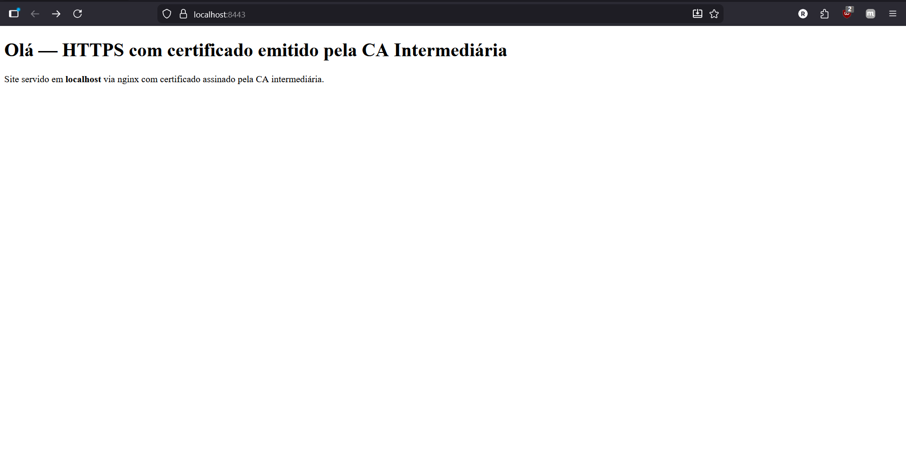

# <center> Relatório do Trabalho T1 </center>
## <center>  Segurança em Computação – 2025/2 
## <center> Infraestrutura de Certificação Digital: Let's Encrypt e PKI Própria

---

### Informações do Grupo
- **Disciplina:** Segurança em Computação 2025/2
- **Integrantes:**  
  - Nome: Artur Mendes  
  - Nome: Renan Campista  
  - Nome: Ricardo Modenese

---

## 1. Arquitetura do Ambiente
Descreva e desenhe (use figuras) a arquitetura geral dos dois cenários implementados, destacando suas diferenças principais:

- **Cenário 1:** Let's Encrypt + ngrok — uso de uma autoridade certificadora pública para emissão automática de certificados válidos por meio do protocolo ACME.  
- **Cenário 2:** PKI própria (Root + Intermediária) — criação e operação de uma infraestrutura de chaves públicas local, com emissão de certificados assinados por uma CA interna.

---

## 2. Tarefa 1 – HTTPS com Certificado Público (Let's Encrypt + ngrok)

### 2.1. Preparação do Ambiente
- Sistema operacional: ____________________ 
- Ferramentas utilizadas: ____________________  
- Versão do Docker / Nginx: ____________________  
- Descreva e disponibilize a configuração do servidor web e a página de exemplo criada:

### 2.2. Exposição com ngrok
- Domínio público gerado: ______________________________  
- Explique como o túnel foi utilizado para permitir a validação do domínio pelo Let's Encrypt.

### 2.3. Emissão do Certificado
- Caminho do certificado gerado: _________________________  
- Explique o processo de validação e emissão e quais arquivos foram gerados.

### 2.4. Configuração HTTPS no Nginx
- Descreva como foi feita a configuração do servidor para uso do certificado emitido.

### 2.5. Resultados e Validação
- URL de acesso: ______________________________  
- Screenshot da página HTTPS: *(inserir imagem)*  
- Resultado do comando de verificação: ______________________________  
- Screenshot do certificado no navegador (cadeado): *(inserir imagem)*  

---

## 3. Tarefa 2 – HTTPS com PKI Própria (Root + Intermediária)

### 3.1. Criação da CA Raiz
A CA raiz (Certificate Authority Root) é o ponto inicial da cadeia de confiança. Ela é responsável por assinar o certificado da CA intermediária, tornando-se a autoridade máxima de confiança dentro de uma PKI (Public Key Infrastructure). Neste trabalho, a CA raiz foi autoassinada, ou seja, o certificado foi emitido e assinado pela própria chave privada da CA raiz. O processo envolveu a geração de um par de chaves RSA de 4096 bits, seguido da criação de um certificado X.509 com validade estendida (por exemplo, 10 anos). Sua principal função é não assinar diretamente certificados de servidores ou usuários, mas apenas CA intermediárias, reduzindo o risco de comprometimento. Caso a chave privada da CA raiz seja comprometida, toda a cadeia se torna inválida, por isso ela deve ser armazenada de forma altamente segura e offline.

### 3.2. Criação da CA Intermediária
A CA intermediária atua como uma ponte entre a CA raiz e os certificados de servidores.
Ela é usada para emitir certificados de servidor ou cliente, preservando a segurança da raiz, que permanece isolada.
O processo consistiu em gerar um novo par de chaves RSA (4096 bits), criar um CSR (Certificate Signing Request) e então assinar esse CSR com a chave privada da CA raiz, produzindo o certificado da CA intermediária.
O uso de uma CA intermediária traz benefícios importantes:

- Aumenta a segurança operacional, pois a CA raiz permanece inativa e protegida.
- Permite revogação e substituição mais simples da intermediária, sem afetar toda a cadeia.
- Facilita a delegação de emissão de certificados em ambientes corporativos.

### 3.3. Emissão do Certificado do Servidor
- Caminho do `fullchain.crt`: certs/server/fullchain.crt 

O processo de emissão do certificado do servidor envolveu:
1. Geração do par de chaves do servidor (server.key);
2. Criação de um CSR (Certificate Signing Request) com o campo Common Name (CN) definido como localhost;
3. Assinatura do CSR pela CA intermediária, resultando em server.crt;
4. Criação do arquivo fullchain.crt, que contém o certificado do servidor concatenado com o da CA intermediária — formando a cadeia completa utilizada pelo Nginx.

O Nginx foi configurado para usar:
```nginx
ssl_certificate     /etc/ssl/certs/fullchain.crt;
ssl_certificate_key /etc/ssl/private/server.key;
```
Assim, o servidor passou a responder via HTTPS com um certificado válido dentro da PKI privada.

### 3.4. Importação da CA Raiz no Navegador
Descreva o procedimento adotado para importar o certificado raiz no navegador:  
- Caminho seguido no navegador (Firefox): Configurações → Privacidade e Segurança → Certificados → Ver Certificados → Autoridades → Importar

- Resultado esperado: navegador passou a confiar na CA criada? Justifique
Sim. Após a importação, o navegador passou a reconhecer a CA raiz como uma autoridade confiável, permitindo que o site https://localhost:8443 fosse exibido como conexão segura (cadeado verde). Isso ocorre porque o navegador agora reconhece a assinatura da CA intermediária (e, por consequência, do certificado do servidor) como parte de uma cadeia confiável que se origina na CA raiz instalada.

- Inclua uma captura de tela do certificado confiável.



### 3.5. Validação da Cadeia
- Resultado do comando de verificação: 
```bash
curl -v --cacert certs/root/root.cert.pem https://localhost:8443/
```
- Output esperado: Página HTML retornada com sucesso, indicando que a cadeia de certificação foi validada corretamente pelo curl ao utilizar o certificado da CA raiz.

- Screenshot do navegador com HTTPS ativo e confiável:


---

## 4. Comparação entre os Dois Cenários
Responda às questões abaixo com base na experiência prática:

- Quais as principais diferenças entre o uso de certificados públicos e privados?  
- Em quais cenários cada abordagem é mais adequada?  
- Por que a importação da CA raiz é necessária no segundo cenário?  

---

## 5. Conclusões
- Apresente as principais lições aprendidas durante o projeto.  
- Explique a importância prática da certificação digital e da confiança em ambientes seguros.

---

## Checklist Final
| Item | Status |
|------|--------|
| Servidor Nginx funcional (Docker) | ✅ / ❌ |
| Certificado Let's Encrypt emitido e válido | ✅ / ❌ |
| PKI própria criada (Root + Intermediária) | ✅ / ❌ |
| Importação da CA raiz no navegador | ✅ / ❌ |
| Cadeia de certificação validada com sucesso | ✅ / ❌ |
| Relatório completo e entregue | ✅ / ❌ |
| Apresentação prática (vídeo) | ✅ / ❌ |

---


