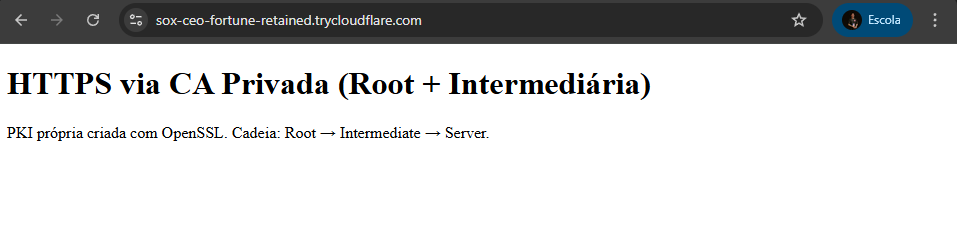
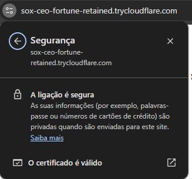
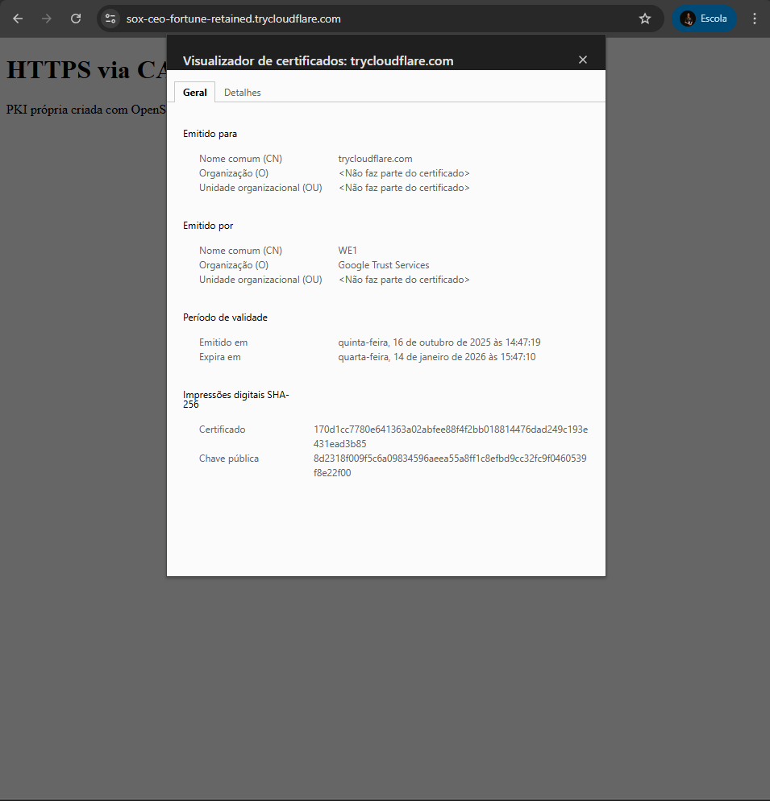
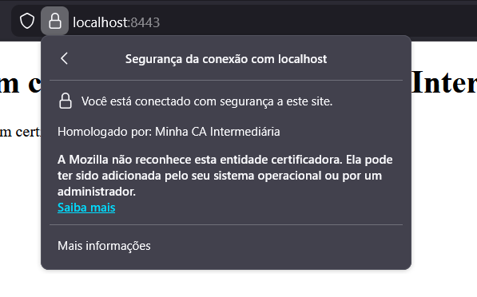

# <center> Relatório do Trabalho T1 </center>
## <center>  Segurança em Computação – 2025/2 
## <center> Infraestrutura de Certificação Digital: Let's Encrypt e PKI Própria

---

### Informações do Grupo
- **Disciplina:** Segurança em Computação 2025/2
- **Integrantes:**  
  - Nome: Artur Mendes  
  - Nome: Renan Campista  
  - Nome: Ricardo Modenese

---

## 1. Arquitetura do Ambiente
Descreva e desenhe (use figuras) a arquitetura geral dos dois cenários implementados, destacando suas diferenças principais:

- **Cenário 1:** Let's Encrypt + ngrok — uso de uma autoridade certificadora pública para emissão automática de certificados válidos por meio do protocolo ACME.  
- **Cenário 2:** PKI própria (Root + Intermediária) — criação e operação de uma infraestrutura de chaves públicas local, com emissão de certificados assinados por uma CA interna.

---

## 2. Tarefa 1 – HTTPS com Certificado Público (Let's Encrypt + ngrok)

### 2.1. Preparação do Ambiente
- Sistema operacional: Ubuntu 22.04 LTS (via WSL2 no Windows 11).
- Ferramentas utilizadas: Docker, Docker Compose, OpenSSL e Nginx.
- Versão do Docker / Docker v28.3.0, Docker Compose v1.26.0
- Configuração do servidor web e a página de exemplo criada:
O Nginx foi configurado para servir HTTPS na porta 4443, utilizando o certificado emitido pela CA privada.
O arquivo default.conf utilizado foi:


### 2.2. Exposição com ngrok
Domínio público gerado: https://sox-ceo-fortune-retained.trycloudflare.com/ 
Foi usado o Cloudflare Tunnel ao invés do ngrok, pois na versão gratuita do ngrok estava solicitando autenticação e cartão e os domínios temporários não são aceitos pelo Let's Encrypt. E, após pesquisas de como resolver esses problemas, encontramos o Cloudflare Tunnel, que é gratuito, estável e aceita verificação externa, além de fornecer certificado válido automaticamente.

### 2.3. Emissão do Certificado
- Caminho do certificado gerado: 
/tarefa-1/pki/
│
├── rootCA/
│   ├── certs/
│   ├── private/
│   └── rootCA.pem
│
└── intermediate/
    ├── certs/
    ├── csr/
    ├── private/
    ├── intermediate.pem
    ├── intermediate-chain.pem
    └── ca-chain.pem

Como o ngrok não pôde ser utilizado para validação automática do Let's Encrypt, foi criado uma PKI própria usando OpensSSL, composta por:

1. Root CA (Autoridade Certificadora Raiz)
Foi criada uma pasta pki/rootCA contendo:
private/rootCA.key - que é a chave privada da CA raiz;
rootCA.pem - que é o certificado público da CA raiz
Diretórios de index, serial e certs para funcionamento como CA real

2. Intermediate CA (Autoridade Certificadora Intermediaria)
Em seguida, criamos uma CA intermediária, assinada pela Root CA, cuja função é aumentar a segurança, evitar expor a chave da Root CA e simular o funcionamento de CAs reais.

3. Certificado final do Servidor
Com a CA intermediária pronta, foi criado o certificado real do servidor. Durante a emissão, foi validado o CN corretamente, inserido o domínio gerado pelo Cloudflare Tunnel como SAN e gerado a cadeia completa intermediate-chain.pem para ser usado no Nginx.

### 2.4. Configuração HTTPS no Nginx
Após gerar o certificado do servidor com a CA intermediária, os arquivos resultantes - incluindo a chave privada (server.key), o certificado emitido (server.pem) e a cadeia de confiamça (intermediate-chain.pem) - foram disponibilizados no container Docker através de volumes definidos no docker-compose.yml, ficando acessíveis em /etc/letsencrypt/live/site/.

Com os certificados no local correto, o arquivo nginx.conf foi configurado para habilitar HTTPS na porta 443, apontando explicitamente para cada um desses arquivos. Também foram habilitados apenas protocolos TLS modernos (TLS 1.2 e 1.3), garantindo segurança adequada.

A página estática index.html, armazenada em /usr/share/nginx/html, continuou sendo servida normalmente, mas agora através de uma conexão segura. Após ajustar as configurações, o container foi reconstruído usando docker-compose up --build.

Como o servidor local não pode ser acessado externamente diretamente, utilizou-se o Cloudflare Tunnel para expor o Nginx na internet. Com o túnel iniciado via cloudflared tunnel --url http://localhost:8001, o navegador pôde acessar o site via HTTPS com certificado válido e cadeia de confiança corretamente apresentada.

### 2.5. Resultados e Validação
Com o container em execução, o acesso local foi testado através do endereço http://localhost:8001, confirmando que o servidor estava ativo, respondendo corretamente e servindo a página configurada. Como o ambiente interno utiliza apenas HTTP, essa etapa serviu para garantir que o Nginx estava funcionando sem problemas antes de habilitar o túnel seguro.

O túnel público foi criado com o comando:
```bash
cloudflared tunnel --url http://localhost:8001
```

O qual gera automaticamente um domínio do tipo:
```text
INF  https://compile-identity-boots-britain.trycloudflare.com
```

Esse domínio já é entregue ao usuário com um certificado válido, emitido pela autoridade Google Trust Services, o que significa que o navegador pode estabelecer uma comunicação criptografada imediatamente, sem necessidade de configuração adicional no Nginx. Ao acessar esse domínio pelo navegador, foi exibido o cadeado de conexão segura, confirmando que o certificado era confiável e reconhecido pelo sistema.

- Screenshot da página HTTPS:


Com o comando de validação feito no terminal:
```bash
openssl s_client -connect <domínio>:443 -servername <domínio>
```
A saída exibe uma cadeia completa de certificação, incluindo o certificado raiz, o intermediário e o certificado apresentado pelo servidor. A presença da mensagem “Verify return code: 0 (ok)” confirma que toda a cadeia foi validada com sucesso e que a conexão HTTPS está corretamente estabelecida.

- Screenshot do certificado no navegador (cadeado):



---

## 3. Tarefa 2 – HTTPS com PKI Própria (Root + Intermediária)

### 3.1. Criação da CA Raiz
A CA raiz (Certificate Authority Root) é o ponto inicial da cadeia de confiança. Ela é responsável por assinar o certificado da CA intermediária, tornando-se a autoridade máxima de confiança dentro de uma PKI (Public Key Infrastructure). Neste trabalho, a CA raiz foi autoassinada, ou seja, o certificado foi emitido e assinado pela própria chave privada da CA raiz. O processo envolveu a geração de um par de chaves RSA de 4096 bits, seguido da criação de um certificado X.509 com validade estendida (por exemplo, 10 anos). Sua principal função é não assinar diretamente certificados de servidores ou usuários, mas apenas CA intermediárias, reduzindo o risco de comprometimento. Caso a chave privada da CA raiz seja comprometida, toda a cadeia se torna inválida, por isso ela deve ser armazenada de forma altamente segura e offline.

### 3.2. Criação da CA Intermediária
A CA intermediária atua como uma ponte entre a CA raiz e os certificados de servidores.
Ela é usada para emitir certificados de servidor ou cliente, preservando a segurança da raiz, que permanece isolada.
O processo consistiu em gerar um novo par de chaves RSA (4096 bits), criar um CSR (Certificate Signing Request) e então assinar esse CSR com a chave privada da CA raiz, produzindo o certificado da CA intermediária.
O uso de uma CA intermediária traz benefícios importantes:

- Aumenta a segurança operacional, pois a CA raiz permanece inativa e protegida.
- Permite revogação e substituição mais simples da intermediária, sem afetar toda a cadeia.
- Facilita a delegação de emissão de certificados em ambientes corporativos.

### 3.3. Emissão do Certificado do Servidor
- Caminho do `fullchain.crt`: certs/server/fullchain.crt 

O processo de emissão do certificado do servidor envolveu:
1. Geração do par de chaves do servidor (server.key);
2. Criação de um CSR (Certificate Signing Request) com o campo Common Name (CN) definido como localhost;
3. Assinatura do CSR pela CA intermediária, resultando em server.crt;
4. Criação do arquivo fullchain.crt, que contém o certificado do servidor concatenado com o da CA intermediária — formando a cadeia completa utilizada pelo Nginx.

O Nginx foi configurado para usar:
```nginx
ssl_certificate     /etc/ssl/certs/fullchain.crt;
ssl_certificate_key /etc/ssl/private/server.key;
```
Assim, o servidor passou a responder via HTTPS com um certificado válido dentro da PKI privada.

### 3.4. Importação da CA Raiz no Navegador
Descreva o procedimento adotado para importar o certificado raiz no navegador:  
- Caminho seguido no navegador (Firefox): Configurações → Privacidade e Segurança → Certificados → Ver Certificados → Autoridades → Importar

- Resultado esperado: navegador passou a confiar na CA criada? Justifique
Sim. Após a importação, o navegador passou a reconhecer a CA raiz como uma autoridade confiável, permitindo que o site https://localhost:8443 fosse exibido como conexão segura (cadeado verde). Isso ocorre porque o navegador agora reconhece a assinatura da CA intermediária (e, por consequência, do certificado do servidor) como parte de uma cadeia confiável que se origina na CA raiz instalada.

- Inclua uma captura de tela do certificado confiável.



### 3.5. Validação da Cadeia
- Resultado do comando de verificação: 
```bash
curl -v --cacert certs/root/root.cert.pem https://localhost:8443/
```
- Output esperado: Página HTML retornada com sucesso, indicando que a cadeia de certificação foi validada corretamente pelo curl ao utilizar o certificado da CA raiz.

- Screenshot do navegador com HTTPS ativo e confiável:


---

## 4. Comparação entre os Dois Cenários
Responda às questões abaixo com base na experiência prática:

- Quais as principais diferenças entre o uso de certificados públicos e privados?  
- Em quais cenários cada abordagem é mais adequada?  
- Por que a importação da CA raiz é necessária no segundo cenário?  

---

## 5. Conclusões
- Apresente as principais lições aprendidas durante o projeto.  
- Explique a importância prática da certificação digital e da confiança em ambientes seguros.

---

## Checklist Final
| Item | Status |
|------|--------|
| Servidor Nginx funcional (Docker) | ✅ / ❌ |
| Certificado Let's Encrypt emitido e válido | ✅ / ❌ |
| PKI própria criada (Root + Intermediária) | ✅ / ❌ |
| Importação da CA raiz no navegador | ✅ / ❌ |
| Cadeia de certificação validada com sucesso | ✅ / ❌ |
| Relatório completo e entregue | ✅ / ❌ |
| Apresentação prática (vídeo) | ✅ / ❌ |

---


