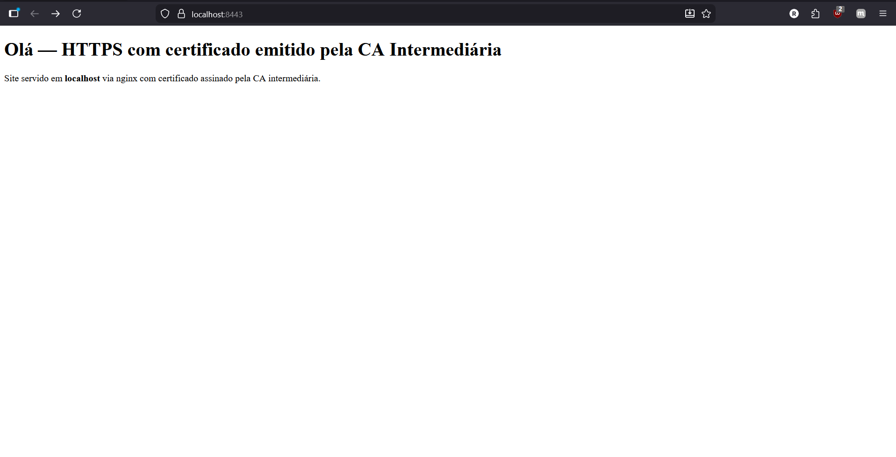

# <center> Relatório do Trabalho T1 </center>
## <center>  Segurança em Computação – 2025/2 
## <center> Infraestrutura de Certificação Digital: Let's Encrypt e PKI Própria

---

### Informações do Grupo
- **Disciplina:** Segurança em Computação 2025/2
- **Integrantes:**  
  - Nome: Artur Mendes  
  - Nome: Renan Campista  
  - Nome: Ricardo Modenese

---

## 1. Arquitetura do Ambiente
Descreva e desenhe (use figuras) a arquitetura geral dos dois cenários implementados, destacando suas diferenças principais:

- **Cenário 1:** Let's Encrypt + ngrok — uso de uma autoridade certificadora pública para emissão automática de certificados válidos por meio do protocolo ACME.  
- **Cenário 2:** PKI própria (Root + Intermediária) — criação e operação de uma infraestrutura de chaves públicas local, com emissão de certificados assinados por uma CA interna.

---

## 2. Tarefa 1 – HTTPS com Certificado Público (Let's Encrypt + ngrok)

### 2.1. Preparação do Ambiente
- Sistema operacional: Ubuntu 22.04 LTS rodando no WSL2 sobre Windows.
- Ferramentas utilizadas: Docker, Docker Compose, Nginx, Certbot e o cliente de túnel cloudflared do Cloudflare.
- Versão do Docker / Nginx: Docker Engine e Docker Compose instalados via distribuição oficial para Ubuntu; Nginx conforme versão da imagem oficial (nginx/1.29.x).
- Configuração do servidor web e a página de exemplo criada:
Para preparar o ambiente, foi criado um diretório específico tarefa1-letsencrypt contendo a estrutura de pastas nginx/, certbot/conf/ e certbot/www/. O servidor web foi empacotado em um container Docker utilizando um docker-compose.yml com um serviço nginx_https_public, que expõe as portas 80 e 443 do container nas portas 8081 e 8443 do host. A configuração do Nginx foi feita no arquivo nginx/nginx.conf, montado dentro do container em /etc/nginx/conf.d/default.conf. No bloco HTTP, o servidor atende a porta 80, serve os arquivos estáticos a partir de /usr/share/nginx/html (montado a partir de nginx/html/) e disponibiliza o caminho especial /.well-known/acme-challenge/ apontando para /var/www/certbot, usado pelo Certbot durante a validação. No bloco HTTPS, o Nginx é configurado para escutar na porta 443 com TLS habilitado e, após a emissão do certificado, utilizar os arquivos fullchain.pem e privkey.pem montados a partir de certbot/conf/. Foi criada também uma página de exemplo simples em nginx/html/index.html, com um texto identificando a tarefa de HTTPS com certificado público, usada como conteúdo de teste durante todo o processo.

### 2.2. Exposição com ngrok
- Domínio público gerado: O domínio é gerado usando o comando
```bash
cloudflared tunnel --url http://localhost:8081 --protocol http2
```
Em vez do ngrok, foi utilizado o serviço de túnel do Cloudflare (cloudflared), que cumpre exatamente o mesmo papel: expor um serviço HTTP/HTTPS local para a Internet por meio de um domínio público temporário. Com o container Nginx já em execução e atendendo em `http://localhost:8081`, foi iniciado o túnel com o comando `cloudflared tunnel --url http://localhost:8081 --protocol http2`. Esse comando cria uma conexão segura entre a máquina local e a infraestrutura do Cloudflare e, como resultado, gera um domínio do tipo `*.trycloudflare.com`. A partir desse momento, qualquer requisição HTTP ou HTTPS feita para esse domínio é redirecionada pelo Cloudflare até o Nginx local na porta 8081. Esse túnel é justamente o que permite que os servidores da Let’s Encrypt consigam acessar o caminho `/.well-known/acme-challenge/...` hospedado localmente e realizar a validação de controle do domínio, de forma equivalente ao que seria feito com ngrok.

### 2.3. Emissão do Certificado
- Caminho do certificado gerado: `/etc/letsencrypt/live/DOMINIO-GERADO/`

Com o túnel ativo e o Nginx servindo corretamente o diretório `/.well-known/acme-challenge/`, foi executado o Certbot em modo webroot utilizando um container dedicado. A partir da raiz do projeto, o comando utilizado foi:
```bash
docker-compose run --rm certbot certonly \
  --webroot -w /var/www/certbot \
  -d DOMINIO-GERADO
```
O parâmetro --webroot indica ao Certbot que ele deve criar os arquivos de desafio dentro de /var/www/certbot/.well-known/acme-challenge/, que está montado no host em certbot/www/ e é servido pelo Nginx no bloco HTTP. A Let’s Encrypt acessa o domínio público gerado pelo túnel (speaking-representing-technological-sounds.trycloudflare.com) e verifica se consegue ler esse arquivo; como o túnel aponta para o Nginx local, a validação é concluída com sucesso. Após essa etapa, o Certbot emite o certificado e grava os arquivos dentro do volume mapeado em /etc/letsencrypt/live/speaking-representing-technological-sounds.trycloudflare.com/ no container, que no host corresponde a certbot/conf/live/speaking-representing-technological-sounds.trycloudflare.com/. São gerados, entre outros, os arquivos fullchain.pem (cadeia completa do certificado, incluindo a CA intermediária da Let’s Encrypt) e privkey.pem (chave privada do servidor). Para simplificar o uso pelo Nginx, esses arquivos foram copiados para nomes genéricos certbot/conf/live/fullchain.pem e certbot/conf/live/privkey.pem, mantendo a cadeia de certificação disponível de forma clara para a configuração do servidor.


### 2.4. Configuração HTTPS no Nginx
Após a emissão do certificado, o Nginx foi configurado para utilizar diretamente os arquivos gerados pelo Certbot. No arquivo nginx/nginx.conf, foi criado um bloco de servidor HTTPS que escuta na porta 443 com a diretiva listen 443 ssl; e utiliza as diretivas ssl_certificate e ssl_certificate_key apontando para /etc/letsencrypt/live/fullchain.pem e /etc/letsencrypt/live/privkey.pem, respectivamente, montadas a partir de certbot/conf/live do host. Esse bloco HTTPS utiliza o mesmo root do servidor HTTP (/usr/share/nginx/html) e entrega a página index.html com o conteúdo da tarefa. O bloco HTTP continua ativo na porta 80 para dois propósitos: servir o diretório /.well-known/acme-challenge/ durante renovações futuras de certificado e redirecionar o restante do tráfego para HTTPS, utilizando um redirecionamento permanente return 301 https://$host$request_uri;. Após ajustar o arquivo de configuração, foi feito o rebuild e restart dos containers com docker-compose down seguido de docker-compose up -d --build, garantindo que o Nginx passasse a carregar o certificado público válido na inicialização.

### 2.5. Resultados e Validação
URL de acesso: https://speaking-representing-technological-sounds.trycloudflare.com

Com o Nginx configurado e o túnel do Cloudflare em execução, a página HTTPS passou a ser acessível publicamente pelo domínio fornecido. No navegador, ao acessar https://speaking-representing-technological-sounds.trycloudflare.com, a página de exemplo é exibida normalmente e o navegador mostra o cadeado de conexão segura. Na visualização de detalhes do certificado, é possível verificar que o certificado foi emitido para o domínio speaking-representing-technological-sounds.trycloudflare.com, com emissor identificado como Let’s Encrypt e período de validade correspondente à data de emissão informada pelo Certbot. Para validar via linha de comando, foi utilizado o comando curl -v https://speaking-representing-technological-sounds.trycloudflare.com/, que mostra o handshake TLS sendo estabelecido com sucesso, o uso de uma suíte de criptografia moderna (por exemplo, TLS 1.3) e o cabeçalho HTTP/1.1 200 OK, confirmando que o certificado é aceito e a página é entregue corretamente.

- Screenshot do navegador com HTTPS ativo e confiável:


- Inclua uma captura de tela do certificado confiável:


## 3. Tarefa 2 – HTTPS com PKI Própria (Root + Intermediária)

### 3.1. Criação da CA Raiz
A CA raiz (Certificate Authority Root) é o ponto inicial da cadeia de confiança. Ela é responsável por assinar o certificado da CA intermediária, tornando-se a autoridade máxima de confiança dentro de uma PKI (Public Key Infrastructure). Neste trabalho, a CA raiz foi autoassinada, ou seja, o certificado foi emitido e assinado pela própria chave privada da CA raiz. O processo envolveu a geração de um par de chaves RSA de 4096 bits, seguido da criação de um certificado X.509 com validade estendida (por exemplo, 10 anos). Sua principal função é não assinar diretamente certificados de servidores ou usuários, mas apenas CA intermediárias, reduzindo o risco de comprometimento. Caso a chave privada da CA raiz seja comprometida, toda a cadeia se torna inválida, por isso ela deve ser armazenada de forma altamente segura e offline.

### 3.2. Criação da CA Intermediária
A CA intermediária atua como uma ponte entre a CA raiz e os certificados de servidores.
Ela é usada para emitir certificados de servidor ou cliente, preservando a segurança da raiz, que permanece isolada.
O processo consistiu em gerar um novo par de chaves RSA (4096 bits), criar um CSR (Certificate Signing Request) e então assinar esse CSR com a chave privada da CA raiz, produzindo o certificado da CA intermediária.
O uso de uma CA intermediária traz benefícios importantes:

- Aumenta a segurança operacional, pois a CA raiz permanece inativa e protegida.
- Permite revogação e substituição mais simples da intermediária, sem afetar toda a cadeia.
- Facilita a delegação de emissão de certificados em ambientes corporativos.

### 3.3. Emissão do Certificado do Servidor
- Caminho do `fullchain.crt`: certs/server/fullchain.crt 

O processo de emissão do certificado do servidor envolveu:
1. Geração do par de chaves do servidor (server.key);
2. Criação de um CSR (Certificate Signing Request) com o campo Common Name (CN) definido como localhost;
3. Assinatura do CSR pela CA intermediária, resultando em server.crt;
4. Criação do arquivo fullchain.crt, que contém o certificado do servidor concatenado com o da CA intermediária — formando a cadeia completa utilizada pelo Nginx.

O Nginx foi configurado para usar:
```nginx
ssl_certificate     /etc/ssl/certs/fullchain.crt;
ssl_certificate_key /etc/ssl/private/server.key;
```
Assim, o servidor passou a responder via HTTPS com um certificado válido dentro da PKI privada.

### 3.4. Importação da CA Raiz no Navegador
Descreva o procedimento adotado para importar o certificado raiz no navegador:  
- Caminho seguido no navegador (Firefox): Configurações → Privacidade e Segurança → Certificados → Ver Certificados → Autoridades → Importar

- Resultado esperado: navegador passou a confiar na CA criada? Justifique
Sim. Após a importação, o navegador passou a reconhecer a CA raiz como uma autoridade confiável, permitindo que o site https://localhost:8443 fosse exibido como conexão segura (cadeado verde). Isso ocorre porque o navegador agora reconhece a assinatura da CA intermediária (e, por consequência, do certificado do servidor) como parte de uma cadeia confiável que se origina na CA raiz instalada.

- Inclua uma captura de tela do certificado confiável.


### 3.5. Validação da Cadeia
- Resultado do comando de verificação: 
```bash
curl -v --cacert certs/root/root.cert.pem https://localhost:8443/
```
- Output esperado: Página HTML retornada com sucesso, indicando que a cadeia de certificação foi validada corretamente pelo curl ao utilizar o certificado da CA raiz.

- Screenshot do navegador com HTTPS ativo e confiável:


---

## 4. Comparação entre os Dois Cenários

### Quais as principais diferenças entre o uso de certificados públicos e privados?

**Certificados Públicos (Cenário 1 - Cloudflare Tunnel):**
- Emitidos por Autoridades Certificadoras reconhecidas globalmente (como Google Trust Services, usada pelo Cloudflare)
- Confiança automática: navegadores e sistemas operacionais já possuem as CAs raiz pré-instaladas
- Validação externa obrigatória: é necessário provar a propriedade do domínio através de desafios ACME (DNS, HTTP, etc.)
- Adequados para ambientes públicos e produção na internet
- Renovação automática possível através de protocolos como ACME
- Custo variável (gratuitos como Let's Encrypt ou pagos)

**Certificados Privados (Cenário 2 - PKI Própria):**
- Emitidos por uma CA criada internamente pela organização
- Requer importação manual da CA raiz em cada cliente (navegador, sistema operacional)
- Controle total sobre o processo de emissão, validade e políticas
- Não há validação externa ou custos recorrentes
- Adequados para ambientes internos, desenvolvimento e redes corporativas
- Maior flexibilidade na personalização de atributos e extensões

### Em quais cenários cada abordagem é mais adequada?

**Certificados Públicos são adequados para:**
- Sites e aplicações web acessíveis publicamente na internet
- APIs e serviços expostos para parceiros externos
- Ambientes de produção que requerem confiança universal
- Situações onde não é viável distribuir e gerenciar certificados raiz manualmente
- Conformidade com regulamentações que exigem CAs reconhecidas

**Certificados Privados (PKI Própria) são adequados para:**
- Ambientes corporativos internos (intranet, VPNs, sistemas de gestão)
- Ambientes de desenvolvimento e testes
- Comunicação entre microsserviços internos
- Cenários onde há controle total sobre os clientes (dispositivos gerenciados por MDM)
- Situações que requerem políticas de certificação personalizadas
- Redução de custos em infraestruturas de grande escala com muitos certificados

### Por que a importação da CA raiz é necessária no segundo cenário?

A importação da CA raiz é necessária porque:

1. **Cadeia de Confiança:** Navegadores e sistemas operacionais mantêm um repositório de CAs confiáveis pré-instaladas. Como a CA raiz criada no projeto é autoassinada e não reconhecida por nenhuma autoridade pública, ela não existe nesse repositório.

2. **Validação de Certificados:** Quando o navegador acessa `https://localhost:8443`, ele recebe o certificado do servidor assinado pela CA intermediária. Para validar essa assinatura, ele precisa verificar toda a cadeia até chegar em uma CA raiz que ele confie. Sem importar a CA raiz criada no projeto, o navegador não consegue completar essa validação e exibe um erro de segurança.

3. **Estabelecimento de Confiança:** Ao importar manualmente o certificado da CA raiz e marcá-lo como confiável, estamos explicitamente dizendo ao navegador: "confie nesta autoridade e em todos os certificados assinados por ela". Isso permite que toda a cadeia (CA Raiz → CA Intermediária → Certificado do Servidor) seja validada com sucesso.

4. **Segurança por Design:** Este processo demonstra um princípio fundamental de PKI: a confiança não é automática, mas explícita e controlada. Em ambientes corporativos, as CAs raiz internas são distribuídas via políticas de grupo ou sistemas de gerenciamento de dispositivos, garantindo que apenas dispositivos gerenciados confiem na PKI da organização.

---

## 5. Conclusões

### Principais lições aprendidas durante o projeto:

1. **Hierarquia de Certificação:** Compreendemos na prática como funciona uma cadeia de confiança PKI, desde a CA raiz autoassinada até o certificado final do servidor, passando pela CA intermediária. Essa estrutura hierárquica não é apenas uma questão técnica, mas uma estratégia de segurança que protege a chave mais crítica (raiz) mantendo-a offline e isolada.

2. **Diferença entre Ambientes Públicos e Privados:** Experimentamos duas abordagens distintas: no Cenário 1, utilizamos infraestrutura pública (Cloudflare Tunnel) que já fornece certificados válidos automaticamente, enquanto no Cenário 2 construímos uma PKI completa do zero. Isso evidenciou os trade-offs entre conveniência/confiança universal versus controle total/customização.

3. **Importância da Validação de Domínio:** Ao tentar usar Let's Encrypt com ngrok, descobrimos que CAs públicas exigem validação rigorosa da propriedade do domínio, o que levou à adoção do Cloudflare Tunnel como alternativa viável para ambientes de demonstração.

4. **Automação vs. Controle Manual:** Os scripts Python desenvolvidos demonstraram como automatizar processos complexos de PKI que normalmente são feitos manualmente com OpenSSL, tornando-os reproduzíveis e menos propensos a erros.

5. **Containerização e Isolamento:** O uso de Docker facilitou a criação de ambientes isolados e reproduzíveis, permitindo testar configurações HTTPS sem interferir no sistema host.

### Importância prática da certificação digital e da confiança em ambientes seguros:

**Fundamento da Segurança na Internet:** A certificação digital é a base de toda a comunicação segura na internet. Sem ela, não seria possível ter confiança em transações bancárias, e-commerce, acesso a sistemas corporativos ou troca de informações sensíveis. Este trabalho demonstrou concretamente como certificados garantem autenticidade (prova de identidade), integridade (dados não foram alterados) e confidencialidade (criptografia da comunicação).

**Cadeia de Confiança como Modelo de Segurança:** A estrutura hierárquica de PKI reflete um princípio fundamental: confiança é transitiva mas controlada. Ao confiar em uma CA raiz, automaticamente confiamos em todos os certificados que ela assina, mas essa confiança pode ser revogada ou limitada a contextos específicos.

**Aplicabilidade Profissional:** Em ambientes corporativos reais, as habilidades desenvolvidas neste projeto são essenciais:
- Gerenciamento de PKI interna para autenticação de funcionários e dispositivos
- Emissão de certificados para microsserviços em arquiteturas de nuvem

**Conscientização sobre Riscos:** O projeto também evidenciou os riscos: se a chave privada da CA raiz for comprometida, toda a infraestrutura se torna insegura. Isso reforça a necessidade de proteção rigorosa de chaves privadas, uso de HSMs (Hardware Security Modules) em produção, e práticas adequadas de backup e recuperação de desastres.

---

## Checklist Final
| Item | Status |
|------|--------|
| Servidor Nginx funcional (Docker) | ✅  |
| Certificado Let's Encrypt emitido e válido | ✅  |
| PKI própria criada (Root + Intermediária) | ✅  |
| Importação da CA raiz no navegador | ✅  |
| Cadeia de certificação validada com sucesso | ✅ |
| Relatório completo e entregue | ✅ |
| Apresentação prática (vídeo) | ✅  |

---


